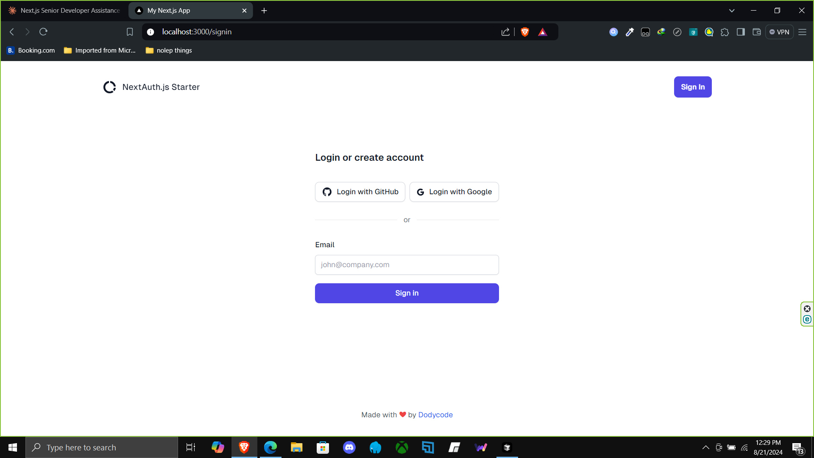

# Next.js Authentication Project Template


This project is a Next.js application with authentication features using NextAuth.js, Supabase, and Tremor for UI components.

## Features

- Next.js 14 with App Router
- Authentication with NextAuth.js
- Email Magic Link Sign In
- GitHub OAuth Sign In
- Google OAuth Sign In
- Supabase as database adapter
- Tremor UI components
- TypeScript
- Tailwind CSS for styling

## Prerequisites

Before you begin, ensure you have met the following requirements:

- Node.js (v14 or later)
- npm or yarn
- A Supabase account and project
- GitHub OAuth application (for GitHub sign-in)
- Google OAuth application (for Google sign-in)
- SMTP server for sending emails (e.g., Gmail SMTP)

## Installation

1. Clone the repository:

   ```
   git clone [https://github.com/dodycode/nextauth-project-template.git](https://github.com/dodycode/nextauth-project-template.git)
   cd nextauth-project-template
   ```

2. Install the dependencies:

   ```
   npm install
   ```

3. Create a `.env.local` file in the root directory and add the following environment variables:

   ```
   NEXTAUTH_URL=http://localhost:3000
   NEXTAUTH_SECRET=your-nextauth-secret

   NEXT_PUBLIC_SUPABASE_URL=your-supabase-project-url
   NEXT_PUBLIC_SUPABASE_ANON_KEY=your-supabase-anon-key
   SUPABASE_SERVICE_ROLE_KEY=your-supabase-service-role-key

   GITHUB_ID=your-github-oauth-client-id
   GITHUB_SECRET=your-github-oauth-client-secret

   GOOGLE_CLIENT_ID=your-google-oauth-client-id
   GOOGLE_CLIENT_SECRET=your-google-oauth-client-secret

   EMAIL_SERVER_USER=username
   EMAIL_SERVER_PASSWORD=password
   EMAIL_SERVER_HOST=smtp.example.com
   EMAIL_SERVER_PORT=587
   EMAIL_FROM=noreply@example.com
   ```

   Replace the placeholder values with your actual credentials.

## Usage

To run the development server:

```
npm run dev
```

Open [http://localhost:3000](http://localhost:3000) with your browser to see the result.

## Project Structure

- `app/`: Contains the Next.js 13 app router pages and layouts
- `components/`: Reusable React components
- `lib/`: Utility functions and configurations
- `public/`: Static assets

## Authentication Flow

1. Users can sign in using their email, GitHub account, or Google account.
2. For email sign-in, a magic link is sent to the user's email.
3. After clicking the magic link or authenticating with GitHub/Google, users are redirected to the dashboard.
4. The session is managed by NextAuth.js and stored in the Supabase database.

## Customization

- Modify the UI components in the `components/` directory to change the look and feel of the application.
- Add or remove authentication providers in the `auth.ts` file.
- Customize the dashboard and other protected pages in the `app/` directory.

## Deployment

This application can be deployed to any platform that supports Next.js applications, such as Vercel, Netlify, or your own server.

Remember to update the `NEXTAUTH_URL` environment variable to your production URL when deploying.

## Contributing

Contributions, issues, and feature requests are welcome. Feel free to check [issues page](https://github.com/dodycode/nextauth-project-template/issues) if you want to contribute.

## License

[MIT](https://choosealicense.com/licenses/mit/)

## Contact

If you have any questions or feedback, please contact [Dodycode](mailto:prasetyodody17@gmail.com).
